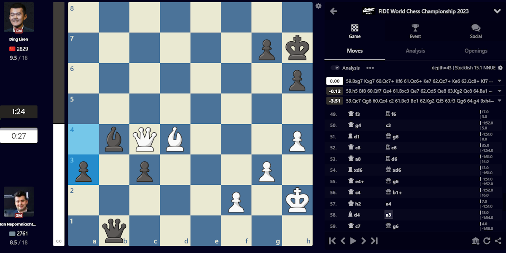
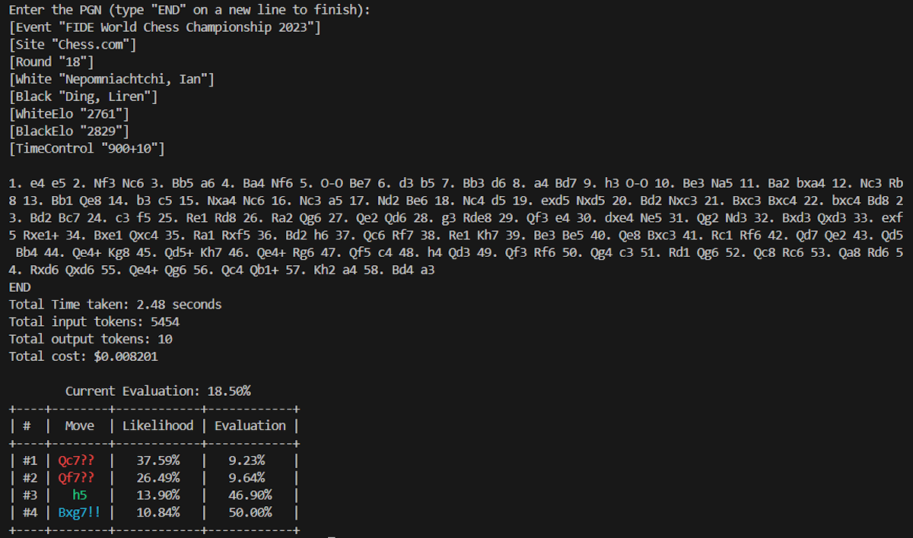
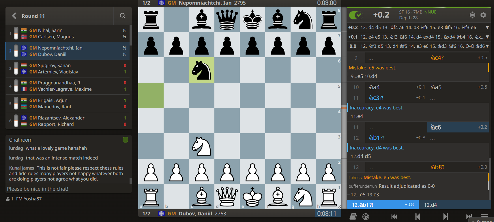
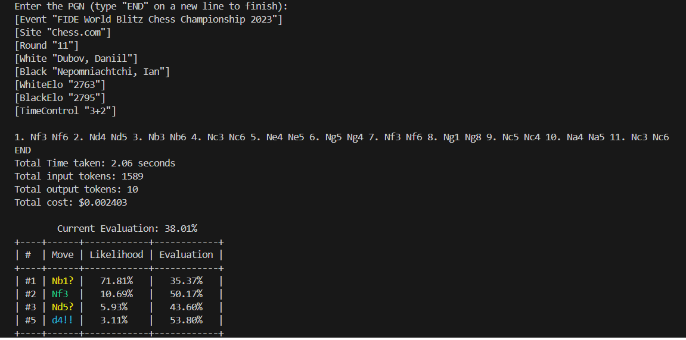

# Oracle Chess Engine

## Introduction

Oracle is the first chess engine that plays like a human, from amateur to super GM. She can play like a 2800-rated player in classical or an 800-rated player in blitz, or at any other level, in any time control.

## Features

- **Human-like Play:** Oracle adapts her predictions to any rating level from amateur to super GM.
- **Time Control Flexibility:** Oracle adapts her predictions to 4 different time controls: bullet, blitz, rapid, or classical.
- **Expected Score Evaluations:** Instead of using centipawns, Oracle evaluates positions by giving White's expected score out of 100 games. This expected score takes into account the position, the likeliest next moves, the rating of both players and the time control.
- **Two Modes:**
  - **Oracle_one_move:** Takes a PGN game as input and predicts the likeliest next moves.
  - **Oracle_pgn_file:** Takes a PGN file with multiple games and predicts every move of every game, useful for creating data to test Oracle.

## Usage

- **Oracle_one_move:** Export `OPENAI_API_KEY` and `STOCKFISH_PATH` (or edit the overrides at the top of `Oracle_one_move`) then run `python Oracle_one_move`. Paste the PGN up to the move you want to predict into the console, type `END`, and press Enter.
- **Oracle_pgn_file:** Export `OPENAI_API_KEY` and `STOCKFISH_PATH` (or edit the overrides at the top of `Oracle_pgn_file`). Run `python Oracle_pgn_file --pgn my_games.pgn --output analysis.csv` to generate predictions; omit the flags to fall back to the defaults defined in the script.
- **Oracle_web:** Installez `flask` (`pip install flask`) puis lancez `python Oracle_web.py`. Ouvrez le navigateur sur <http://127.0.0.1:8000> pour utiliser l'interface graphique.
  - Réglez ORACLE_WEB_LOG_LEVEL (ex. DEBUG) et ORACLE_WEB_DEBUG=true pour activer un journal détaillé.

## Free Online LLM (Hugging Face Serverless)

Oracle peut fonctionner gratuitement via l'API serverless de Hugging Face en utilisant des modèles d'inférence publics pour la génération de texte. Configurez l'environnement suivant :

1. Créez un compte Hugging Face et générez un token lecture (Settings → Access Tokens). Depuis septembre 2025, l'appel aux points de terminaison serverless nécessite un token associé à un mode de facturation actif et à l'acceptation des conditions d'utilisation de chaque modèle : <https://huggingface.co/settings/tokens>.
2. Exportez les variables d'environnement suivantes :

   | Variable | Description | Valeur par défaut |
   | --- | --- | --- |
   | `LLM_PROVIDER` | Sélectionne le backend | `hf_serverless` |
   | `HF_API_TOKEN` | Token Hugging Face requis (accepte aussi `HUGGINGFACEHUB_API_TOKEN`) | *(vide)* |
  | `HF_MODEL_ID` | Modèle primaire text-generation | `meta-llama/Llama-3.1-8B-Instruct` |
  | `HF_MODEL_CANDIDATES` | Liste CSV des candidats (ordre de fallback) | Découverte dynamique (limitée aux checkpoints `hf-inference` comme `meta-llama/Llama-3.1-8B-Instruct`). Utilisez la syntaxe `provider::model_id` pour cibler un provider spécifique (ex. `novita::meta-llama/Llama-3.1-8B-Instruct`). |
   | `HF_TOP_N_TOKENS` | Nombre de tokens renvoyés par la distribution | `10` |
   | `HF_TEMPERATURE` | Température (laisser `0` pour un comportement déterministe) | `0` |

   Exemple PowerShell (persistance Windows) :

   ```powershell
   setx LLM_PROVIDER "hf_serverless"
   setx HF_API_TOKEN "hf_xxxxxxxxxxxxxxxxx"
  setx HF_MODEL_ID "meta-llama/Llama-3.1-8B-Instruct"
  setx HF_MODEL_CANDIDATES "meta-llama/Llama-3.1-8B-Instruct,mistralai/Mistral-7B-Instruct-v0.3,google/gemma-2-2b-it"
   setx HF_TOP_N_TOKENS "10"
   setx HF_TEMPERATURE "0"
   ```

   Exemple `.env` (Unix/macOS) :

   ```bash
   export LLM_PROVIDER="hf_serverless"
   export HF_API_TOKEN="hf_xxxxxxxxxxxxxxxxx"
  export HF_MODEL_ID="meta-llama/Llama-3.1-8B-Instruct"
  export HF_MODEL_CANDIDATES="meta-llama/Llama-3.1-8B-Instruct,mistralai/Mistral-7B-Instruct-v0.3,google/gemma-2-2b-it"
   export HF_TOP_N_TOKENS="10"
   export HF_TEMPERATURE="0"
   ```

Le provider détecte automatiquement les erreurs « not supported for task text-generation … conversational ». En cas de routage vers un point de terminaison chat-only, il bascule instantanément sur le prochain modèle de `HF_MODEL_CANDIDATES` et relance la requête tout en conservant l'extraction des logprobs (`details` + `top_n_tokens`). Les probabilités retournées pour chaque coup sont normalisées pour sommer à 100 % (±0,1) dans l'API `/api/analyze`.


## Examples



Position after 58...a3 in the last tie-break of the [2023 World Championship.](https://www.chess.com/events/2023-fide-world-chess-championship/18/Nepomniachtchi_Ian-Ding_Liren) Stockfish shows 0.00, but considering it's rapid, Oracle only gives white a 18.50% expected score. Nepo ended up blundering with 59. Qc7??, which was the likeliest move according to Oracle.





Position after 11...Nc6 in the infamous "Danse of the Knights" pre-arranged draw between [Daniil Dubov and Ian Nepomniachtchi](https://lichess.org/broadcast/2023-fide-world-blitz-championship--boards-1-30/round-11/yem1lgfo/ESRRgphO) at the 2023 World Blitz Championship. Despite it being an obviously bad move, Oracle predicts 12. Nb1 that was actually played by Nepo and gives it a high 72% likelihood.



## Requirements

Oracle uses GPT-3.5 turbo instruct and Stockfish to deliver human-like chess moves. Users need an [OpenAI API key](https://platform.openai.com/api-keys) and a version of Stockfish, which can be downloaded [here](https://stockfishchess.org/download/).

## Configuration

By default, Stockfish is set to a time limit of 1.3 seconds, a depth limit of 20 plies, uses 8 threads and 512 MB of hash. You can change these settings in the analyze_moves function.

## Time

On my computer, Oracle takes on average about 2 seconds per move. This duration could be reduced with an optimized code and better hardware.

## Cost

Because Oracle uses GPT for her prediction, she is costly! The average cost is ~400 predictions per $1 but can vary greatly with the length of the prompt (up to 10.000 predictions per $1 for opening moves with a short header)

## Author's Note

I am a FIDE Master and Woman International Master with no previous coding experience, so the code might contains mistakes or improper formulations.

## Oracle's name


I've decided to name my chess engine Oracle because just like the Oracle from The Matrix, her predictions feel magical even though they are just pure calculations performed by a program. For that reason, Oracle should be referred to as she/her.

## Contributions and Future of Oracle

Because I'm new to coding, Oracle's code should be improvable.
The next significant step for Oracle would be the creation of an open-source LLM trained on full PGNs with headers to replace GPT-3.5 Turbo Instruct, making Oracle completely free.
Following this, Oracle could be turned into a user-friendly executable file and used on a large scale for broadcasts, training, opening preparation, anti-cheating, bots creation, and so on.

## Support and Donation

I have dedicated several hundred hours to this project and invested a significant amount of money. As a professional chess player and coach, my resources are limited. While I am happy to offer Oracle to the chess and scientific communities for free, any donation would be greatly appreciated.

If you value my work and wish to support Oracle and me, please consider [making a donation.](https://www.paypal.com/donate/?hosted_button_id=6WTAEDBXAPTLC)
<p align="center">
  <a href="https://www.paypal.com/donate/?hosted_button_id=6WTAEDBXAPTLC">
    
  </a>
</p>

I would be very thankful. 🙏

## Read More

I've written an [extensive article](https://yoshachess.com/article/oracle/) on my personnal website

## License

This project is licensed under the MIT License. See the MIT License file for details.

## Copyright

© 2024 Yosha Iglesias. All rights reserved.
